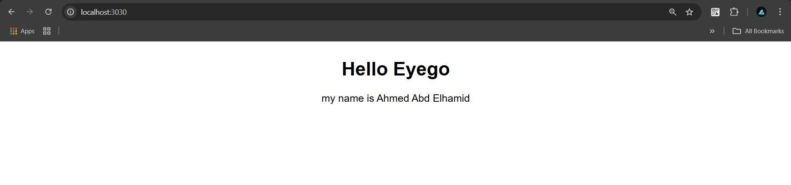
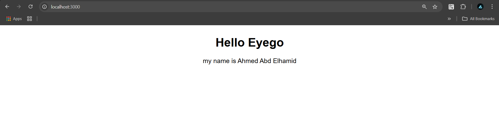
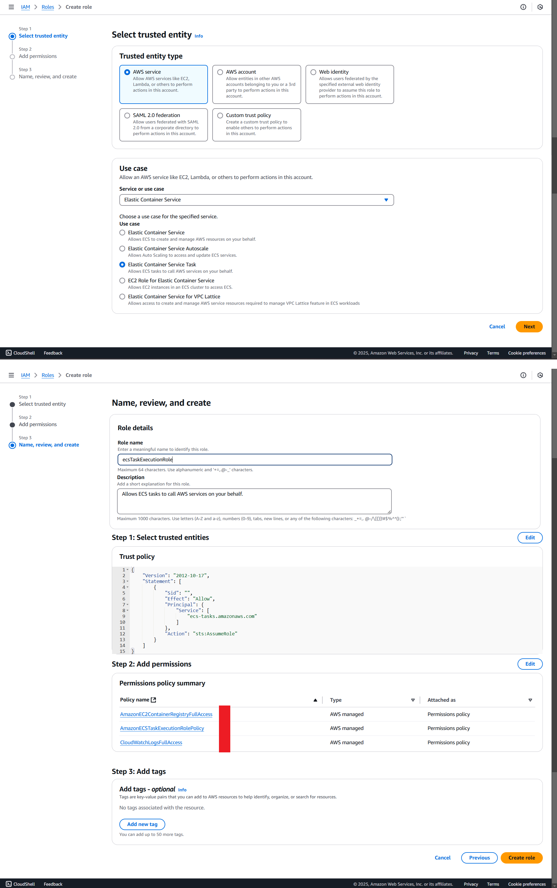
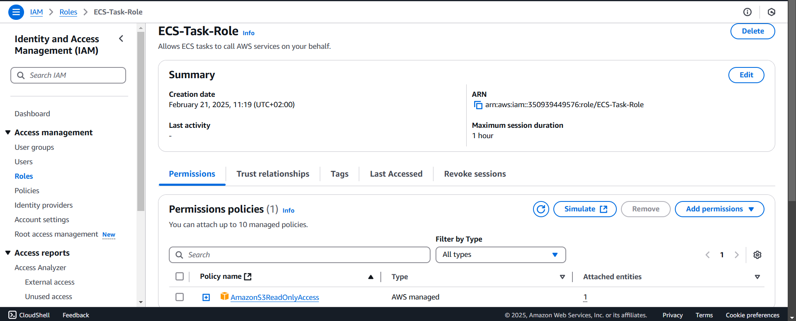
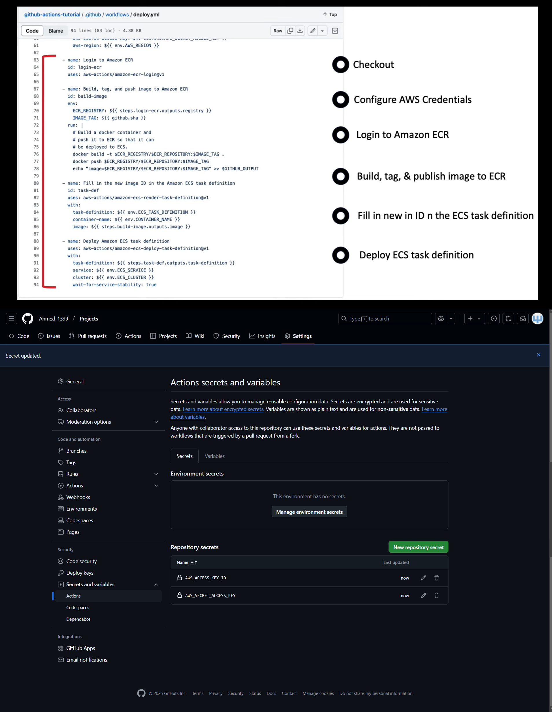
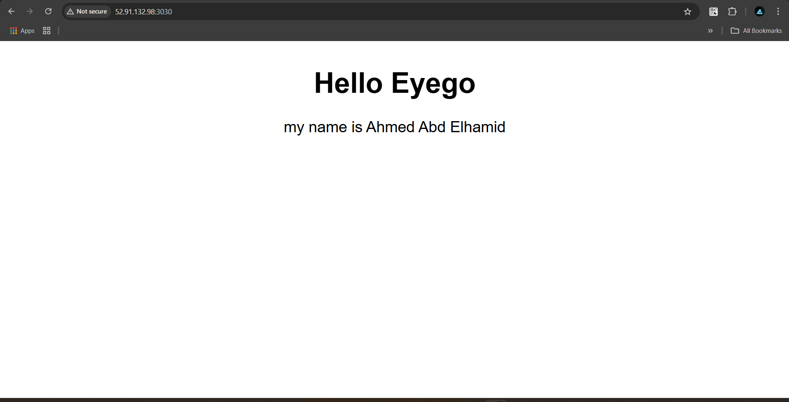

# A. Simple web app (NodeJS)  ----->     ECS

## What is Express?
```bash
    - Framework for "NodeJS"
    - Help in building "Web-Application"
```

## Why Express?
```bash
    - Provides simplified methods for setting up a "web server" in Node.js
```

## why we need package.json?
```bash
    - Essential file in any "NodeJS Project"
    - Contain "Dependencies" & "Scripts" needed to run the Project
    - unify Versions
    - Share Project without needing to "node_modules"
```

## Commands requires for NodeJs
```bash
npm init -y     --->   to Create "Package Json"

npm i express   --->   to install "Express" Library

node app.js     --->   to Run the Application
```
### Architecture


### 1-Build Image
```bash
docker build -t simple-nodejs:v1 .

- Check Size of Image
docker inspect simple-nodejs:v1 -f '{{.Size}}'

- Check Layers of Image
docker history simple-nodejs:v1 
```

### 2-Test Image Locally
docker run --name test -d -p 3000:3030 simple-nodejs:v1
localhost:3000

### Architecture


### 3-Tag Image
docker tag simple-nodejs:v1 ahmed1399/simple-nodejs:v1

### 4-push image                  
docker push ahmed1399/simple-nodejs:v1


# B. Push the image to AWS ECR
```bash
####################################################################################################
                                [ Create Repo & Push the Image on AWS to ECR]
####################################################################################################
### 1-Authenticate AWS CLI:
aws configure

- "then write your access key & secret access key"

### 2-Create an ECR Repository:
aws ecr create-repository --repository-name simple-nodejs

### 3-Login to AWS ECR:

# aws ecr get-login-password --region us-east-1 | docker login --username AWS --password-stdin <ECR-URL>
aws ecr get-login-password --region us-east-1 | docker login --username AWS --password-stdin <your-account-id>.dkr.ecr.us-east-1.amazonaws.com

### 4-Tag & Push the Docker Image:
docker tag simple-nodejs:v1 <your-account-id>.dkr.ecr.us-east-1.amazonaws.com/simple-nodejs:v1

docker push <your-account-id>.dkr.ecr.us-east-1.amazonaws.com/simple-nodejs:v1
```
# C. Push your Project on Github
```bash
- Push Your Project to Github

- Set Up GitHub Actions for Deployment "Ceate Token"s
```
# D. Create ECS Task Definition and Service
```bash
####################################################################################################
                                [ Deploy My Website on AWS ECS with GitHub Actions]
####################################################################################################
            #   ECS Cluster  --->  ECS Task Defination  --->  ECS Service

1. Create an ECS cluster:

   aws ecs create-cluster --cluster-name <Name>

2. Create the ECS Task Definition:

    A. Create CloudWatch Log Directory
        ## Give ECS Permission to Write Logs to "AWS Cloud Watch"
        aws logs create-log-group --log-group-name /ecs/log-name

        ## This {Log} will appear in {CloudWatch  ----->  log lroups}

    B. Create an `ecs-task-def.json` file in your repository with the necessary configuration.

    C. Create the roles required for the task definition.

    D. Register Task Defination
        aws ecs register-task-definition --cli-input-json "$(cat ./.aws/ecs-task-def.json)"

    E. Create an ECS Security Group to allow HTTP and HTTPS traffic.

***********************************************************************************************
3. Create an ECS Service
***********************************************************************************************
aws ecs create-service \
--cluster test-cluster \
--service-name test-ecs-service \
--task-definition task-def-family-name \
--desired-count 1 \
--launch-type FARGATE \
--network-configuration "awsvpcConfiguration={subnets=[subnet-0f11f521e1fb4089f],securityGroups=[sg-051c54763a73c6481],assignPublicIp=ENABLED}" 
***********************************************************************************************
             [If you want to Delete Service]
***********************************************************************************************
aws ecs delete-service --cluster test-cluster --service test-ecs-service --force
***********************************************************************************************

4. Check ECS Task Status

aws ecs describe-tasks --cluster test-cluster \
--tasks <your-task-id> \
```
### Create the roles required for the task definition[ecsTaskExecutionRole]

### Create the roles required for the task definition[ecsTaskRole]


# E. Create Github Action
```bash
    # 1.From "Your Repo" Click on {Action} 
    # 2. Choose [Deploy to Amazon ECS] & Click [Configure]
    # 3. Modify [Deploy to Amazon ECS]
    # 4. to pass values to [Configure AWS Credentials] went to [Settings] in {your Repo}
        # a. Click on [Secret and Variables]
        # b. Click on [Actions]
        # C. Click on [New Repository Secret] 
```
### Github Action Secret


# F.Commit Code Changes
```bash
    Commit code changes to deploy.yml code from GitHub to ECS using GitHub Actions.
```   
# G.Output
## Architecture


### Ensure to allow [HTTP, HTTPS, "Container-Port"] in the "Inbound" of Security-Group
